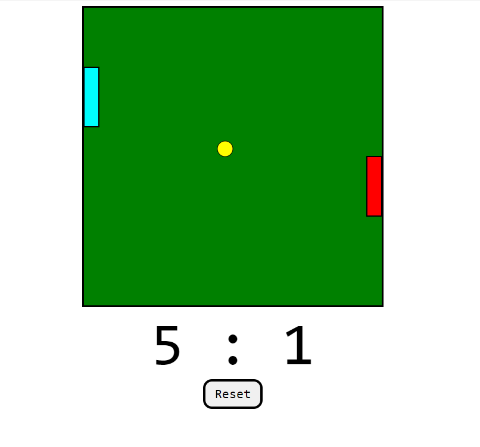

# pongGame

## Overview

This is a basic Pong game built with HTML5 Canvas and JavaScript. The game simulates the classic Pong arcade game with two paddles and a bouncing ball.

## How to Play

1. Open the HTML file in a web browser.
2. Use the arrow keys and 'W'/'S' keys to control the paddles.
3. Bounce the ball between the paddles to score points.
4. The game keeps track of each player's score at the top.
5. Click the "Reset" button to start a new game.

## Controls

- Player One (Left Paddle):

Up: 'W' key

Down: 'S' key

- Player Two (Right Paddle):

Up: Up Arrow key

Down: Down Arrow key

## Technologies Used

HTML5 Canvas

JavaScript

## App

